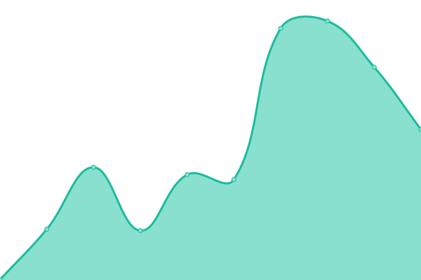
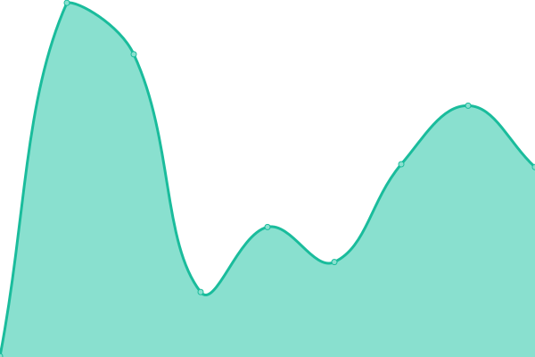

# [📈 Live Status](https://gopcn.github.io/upptime): <!--live status--> **🟩 All systems operational**

This repository contains the open-source uptime monitor and status page for [神经蛙](https://gopcn.github.io/upptime), powered by [Upptime](https://github.com/upptime/upptime).

With [Upptime](https://upptime.js.org), you can get your own unlimited and free uptime monitor and status page, powered entirely by a GitHub repository. We use [Issues](https://github.com/gopcn/upptime/issues) as incident reports, [Actions](https://github.com/gopcn/upptime/actions) as uptime monitors, and [Pages](https://gopcn.github.io/upptime) for the status page.

<!--start: status pages-->
<!-- This summary is generated by Upptime (https://github.com/upptime/upptime) -->
<!-- Do not edit this manually, your changes will be overwritten -->
<!-- prettier-ignore -->
| URL | Status | History | Response Time | Uptime |
| --- | ------ | ------- | ------------- | ------ |
|  [AList](https://a.gopcn.repl.co) | 🟩 Up | [a-list.yml](https://github.com/gopcn/upptime/commits/HEAD/history/a-list.yml) | 

 2300ms
     
 | 

<a href="https://gopcn.github.io/upptime/history/a-list">100.00%</a>
    

|  [Cloudreve](https://c.sdufe.repl.co) | 🟩 Up | [cloudreve.yml](https://github.com/gopcn/upptime/commits/HEAD/history/cloudreve.yml) | 

 463ms
     
 | 

<a href="https://gopcn.github.io/upptime/history/cloudreve">100.00%</a>
    

|  [memos](https://m.sdufe.repl.co) | 🟩 Up | [memos.yml](https://github.com/gopcn/upptime/commits/HEAD/history/memos.yml) | 

 346ms
     
 | 

<a href="https://gopcn.github.io/upptime/history/memos">100.00%</a>
    

|  [Typecho](https://s.sdufe.repl.co) | 🟩 Up | [typecho.yml](https://github.com/gopcn/upptime/commits/HEAD/history/typecho.yml) | 

 388ms
     
 | 

<a href="https://gopcn.github.io/upptime/history/typecho">100.00%</a>
    

|  [Waline](https://zeabur-starter.zeabur.app) | 🟩 Up | [waline.yml](https://github.com/gopcn/upptime/commits/HEAD/history/waline.yml) | 

 425ms
     
 | 

<a href="https://gopcn.github.io/upptime/history/waline">100.00%</a>
    

|  [One API](https://cnki.zeabur.app) | 🟩 Up | [one-api.yml](https://github.com/gopcn/upptime/commits/HEAD/history/one-api.yml) | 

 467ms
     
 | 

<a href="https://gopcn.github.io/upptime/history/one-api">100.00%</a>
    

|  [Uptime Kuma](https://u.sdufe.repl.co) | 🟩 Up | [uptime-kuma.yml](https://github.com/gopcn/upptime/commits/HEAD/history/uptime-kuma.yml) | 

 588ms
     
 | 

<a href="https://gopcn.github.io/upptime/history/uptime-kuma">100.00%</a>
    

<!--end: status pages-->

[**Visit our status website →**](https://gopcn.github.io/upptime)

## 📄 License

- Powered by: [Upptime](https://github.com/upptime/upptime)
- Code: [MIT](./LICENSE) © [神经蛙](https://gopcn.github.io/upptime)
- Data in the `./history` directory: [Open Database License](https://opendatacommons.org/licenses/odbl/1-0/)
